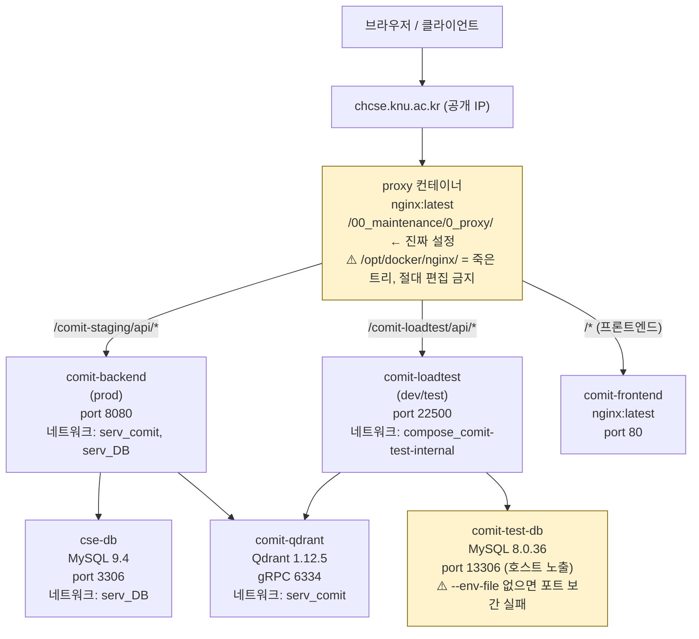
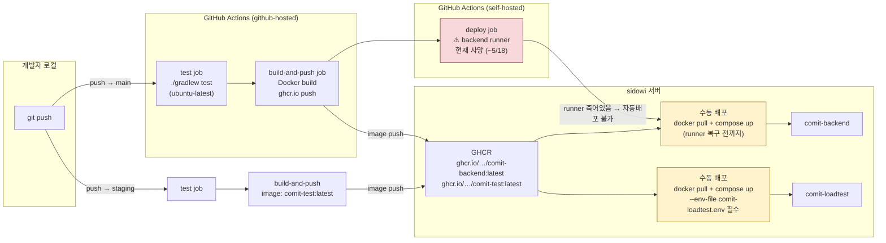
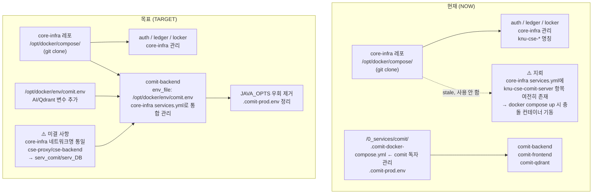

# COMIT 인프라 전체 구조 개요

> 대상 독자: 서버를 처음 보는 관리자 / 신규 팀원  
> 작성일: 2026-06-04

---

## 다이어그램 1 — 요청 흐름 (Request Path)

> 브라우저에서 API 응답까지 패킷이 어디를 거치는지.



### 핵심 경로 요약

| URL 경로 | 실제 역할 | 백엔드 컨테이너 |
|---|---|---|
| `/comit-staging/api/` | **운영 (prod)** | `comit-backend:8080` |
| `/comit-staging/` (non-api) | 운영 프론트엔드 | `comit-frontend:80` |
| `/comit-loadtest/api/` | **개발/테스트 서버** (제안) | `comit-loadtest:22500` |

> `/comit-staging/`이 "staging"처럼 보이지만 실제로는 **운영 서버**다. 이름의 역사적 배경은 [`10_comit-naming-and-infra-drift.md`](./10_comit-naming-and-infra-drift.md) 참고.

---

## 다이어그램 2 — 배포 파이프라인 (CI/CD)

> 코드 변경이 서버에 반영되기까지의 흐름.



### 브랜치 → 이미지 → 컨테이너 매핑

| git 브랜치 | CI 파일 | GHCR 이미지 | 컨테이너 | 환경 |
|---|---|---|---|---|
| `main` | `deploy.yml` | `comit-backend:latest` | `comit-backend` | **운영** |
| `staging` | `deploy-staging.yml` | `comit-test:latest` | `comit-loadtest` | **개발/테스트** |

### 운영 수동 배포 명령

```bash
# sidowi에서
docker pull ghcr.io/committee-of-system-library/comit-backend:latest
docker compose \
  -f /0_services/comit/.comit-docker-compose.yml \
  --env-file /0_services/comit/.comit-prod.env \
  up -d --no-build --pull never comit-backend
```

### 개발 서버 수동 배포 명령

```bash
# sidowi에서 — ⚠️ --env-file 없으면 MYSQL_PORT 보간 실패로 크래시
docker pull ghcr.io/committee-of-system-library/comit-test:latest
cd /opt/docker/compose && docker compose \
  --env-file /opt/docker/env/comit-loadtest.env \
  -f docker-compose.test.yml \
  up -d --no-deps comit-loadtest
```

---

## 다이어그램 3 — 관리 구조: 현재 vs 목표

> 컨테이너 설정·환경변수가 어디서 관리되는지.



---

## 서버 관리자 플로우 가이드

### 1. nginx 설정 변경

```bash
# 1. 진짜 설정 파일 편집 (root 소유 → Docker 그룹 우회 필요)
docker run --rm \
  -v /00_maintenance/0_proxy/conf.d:/conf \
  -v "$HOME":/src \
  nginx:latest \
  sh -c 'cp /src/comit.conf /conf/comit.conf'

# 2. 문법 확인 + 반영
docker exec proxy nginx -t
docker exec proxy nginx -s reload
```

> ❌ `/opt/docker/nginx/`는 절대 편집하지 않는다 — 어떤 컨테이너에도 마운트되지 않은 죽은 트리.

---

### 2. 환경변수 추가/수정

현재 env 파일이 컨테이너에 들어가는 경로:

```
.comit-prod.env (또는 comit.env)
    │
    ▼ --env-file (YAML ${VAR} 치환용)
docker-compose.yml
    │
    ▼ environment: 섹션에 명시된 키만
comit-backend 컨테이너
```

> `--env-file`은 컨테이너에 직접 주입하지 않는다. `environment:` 섹션에 키가 있어야 컨테이너에 전달된다.  
> **목표 상태(core-infra)**에서는 `env_file:` 서비스 항목을 써서 파일 내 모든 변수가 자동 전달된다.

```bash
# 환경변수 추가 시 (현재 임시 방법 — root 소유)
docker run --rm -v /0_services/comit:/data nginx:latest \
  sh -c 'echo "NEW_VAR=value" >> /data/.comit-prod.env'

# 이후 컨테이너 재시작
docker compose -f /0_services/comit/.comit-docker-compose.yml \
  --env-file /0_services/comit/.comit-prod.env \
  up -d --no-build --pull never comit-backend
```

---

### 3. 배포 검증

```bash
# 운영 서버 시각 API (200이면 정상)
curl https://chcse.knu.ac.kr/comit-staging/api/time

# 개발 서버 시각 API
curl https://chcse.knu.ac.kr/comit-loadtest/api/time

# 컨테이너 헬스 확인
docker ps --filter name=comit-backend --format "{{.Status}}"
docker ps --filter name=comit-loadtest --format "{{.Status}}"
```

---

### 4. 서버 재시작 후 기동 순서

```
1. docker compose -f docker-compose.infra.yml up -d    # proxy, DB, 네트워크 생성
2. docker compose -f docker-compose.services.yml up -d # auth, ledger, locker
3. /0_services/comit/ 또는 core-infra로 comit 기동     # comit-backend, comit-frontend, comit-qdrant
4. docker compose -f docker-compose.test.yml up -d     # comit-loadtest (개발 서버)
```

---

## 개발 서버(comit-loadtest) 현황

현재 이 환경에는 **세 가지 다른 이름**이 붙어 있다:

| 관점 | 이름 | 비고 |
|---|---|---|
| GitHub 레포 | `comit-perf` | 부하 테스트 목적으로 생성 |
| GHCR 이미지 | `comit-test:latest` | staging 브랜치 빌드 |
| 컨테이너/URL | `comit-loadtest` | `/comit-loadtest/api/` |

**현실**: `staging` 브랜치 코드가 배포되는 유일한 비운영 환경이다. 개발 중인 기능을 운영 반영 전에 검증하는 용도로 쓰인다.

**제안**: 이 환경을 "개발 서버(dev)"로 공식 정의하는 것이 합리적이다. 단, 명칭 통일(이미지명 `comit-dev`, 컨테이너명 `comit-dev`, 경로 `/comit-dev/api/`)은 다음을 수반하므로 팀 결정 필요:
- `staging` 브랜치 CI 파일 수정 (`STAGING_IMAGE_NAME` 등)
- nginx conf.d 경로 변경
- 프론트엔드 `VITE_API_BASE_URL` 변경

---

## 진행 중인 개선 작업 (TODO)

| 작업 | 우선순위 | 상태 |
|---|---|---|
| `comit.env`에 AI/Qdrant 환경변수 추가 | 🔴 높음 | 미완 |
| core-infra services.yml 에서 `knu-cse-comit-server` → `comit-backend` 교체 | 🔴 높음 | 미완 |
| core-infra 네트워크명 통일 (`cse-*` → `serv_*`) | 🟡 중간 | 조사 필요 |
| `JAVA_OPTS` 우회 제거 후 `.comit-prod.env` 정리 | 🟡 중간 | 위 완료 후 가능 |
| self-hosted backend runner 복구 | 🟡 중간 | 인프라팀 |
| nginx `/comit-staging/time` 잉여 블록 제거 | 🟢 낮음 | 미완 |
| 개발 서버 명칭 통일 (`comit-loadtest` → `comit-dev`) | 🟢 낮음 | 팀 결정 필요 |
