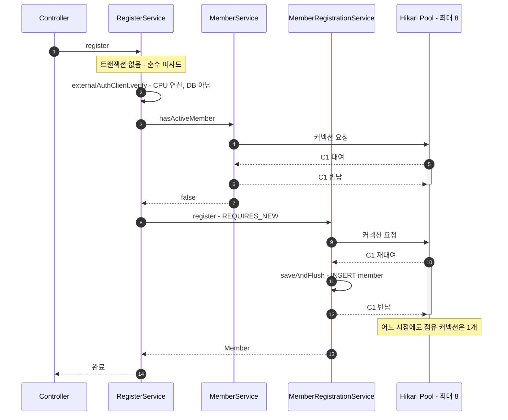
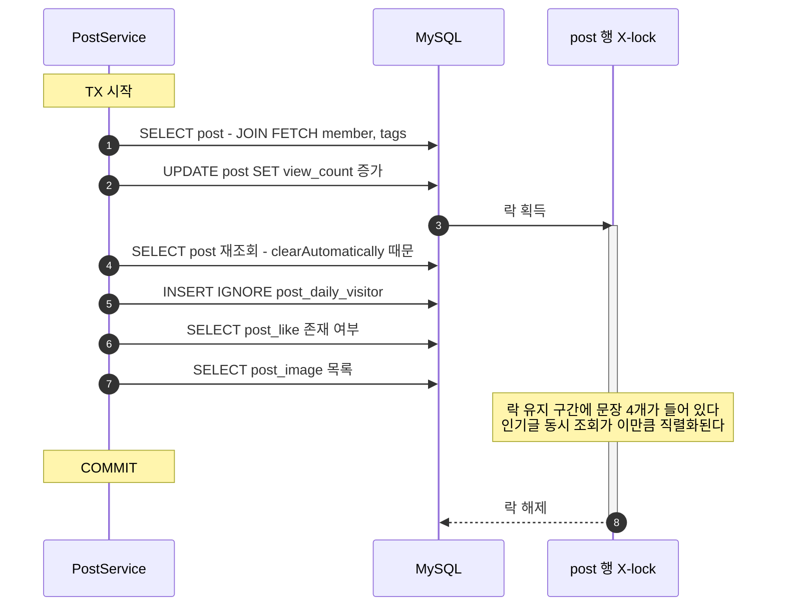
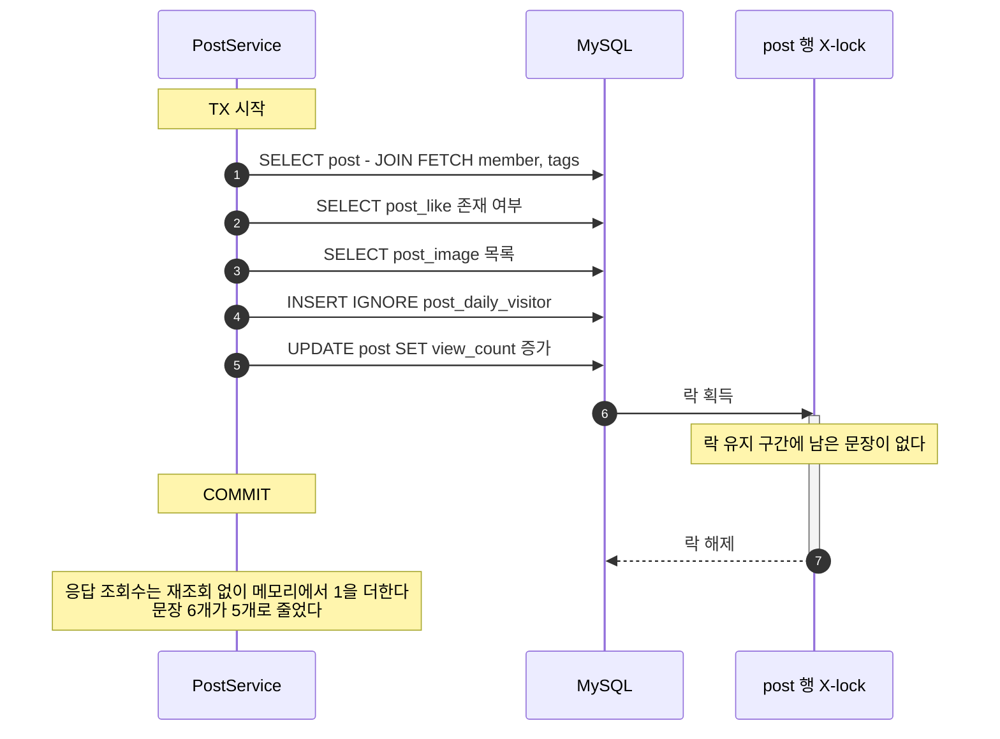
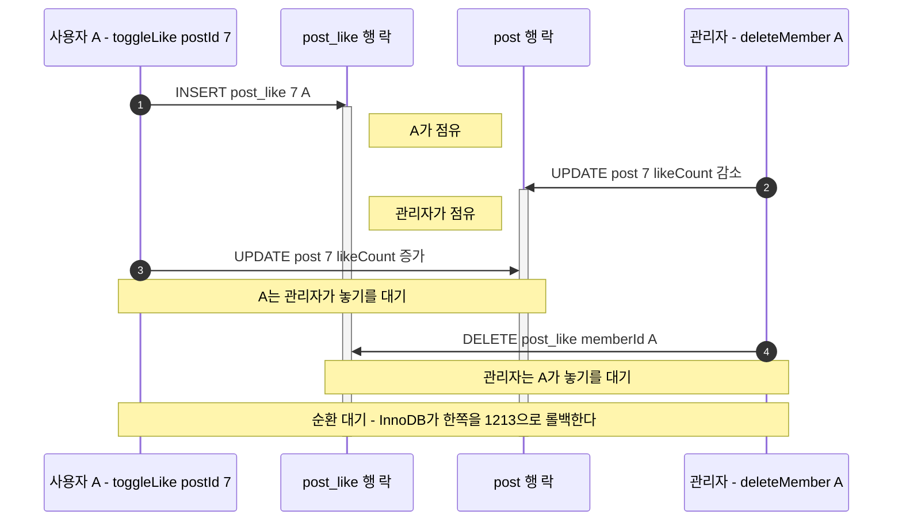
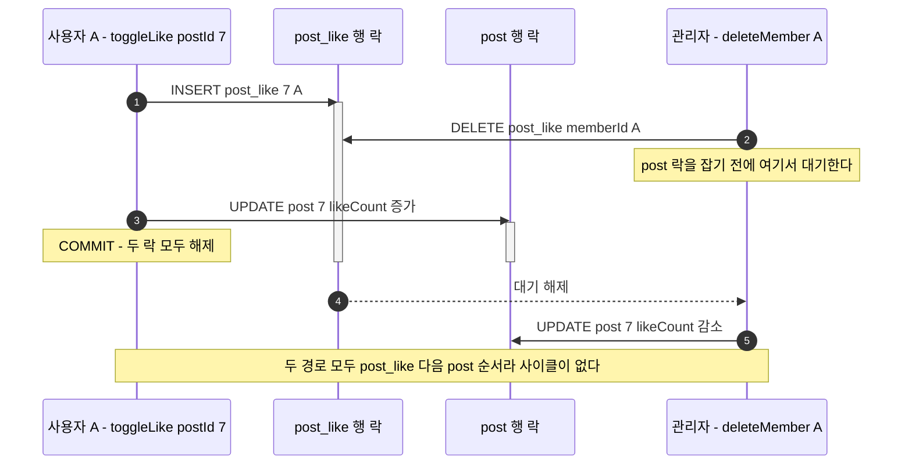

# transaction-boundary-convention

트랜잭션과 락을 **필요한 만큼만** 잡기 위한 규칙, 그리고 현재 코드베이스 전수 감사 결과.

> **한 줄 원칙**
> 트랜잭션 경계 안에는 DB 작업만 둔다. 락을 잡는 문장은 트랜잭션의 **마지막**에 둔다.

원리 출처는 [Facade 객체를 활용해 트랜잭션에서 외부 API 통신 분리하기](https://xxeol.tistory.com/48)다.
다만 이 컨벤션은 그 글을 수입한 것이 아니라, **이미 우리 코드에서 두 군데가 정답대로 짜여 있고 나머지가 그렇지 않아서** 그 두 군데를 규칙으로 승격시킨 것이다(§2).

---

## 0. 이 문서를 여는 시점

| 신호 | 확인할 것 |
|---|---|
| Hikari `connection-timeout` 3초 초과 실패 급증 | `hikaricp_connections_pending`, `hikaricp_connections_acquire_seconds` — §4 L1 |
| `Deadlock found when trying to get lock` (MySQL 1213) | `SHOW ENGINE INNODB STATUS` → LATEST DETECTED DEADLOCK — §4 L3 |
| `Lock wait timeout exceeded` (MySQL 1205) | 어느 row에 몰렸는지 `performance_schema.data_locks` — §4 L2/L4 |
| 특정 게시글·행사에서만 p99가 튐 (hot row) | 해당 경로의 락 획득 시점 — §4 L2 |
| `@Transactional` 메서드를 새로 쓰거나 고칠 때 | §5 리뷰 절차를 그대로 돌린다 |

> 배포·운영 문서철에 두지만 내용은 코딩 컨벤션이다. 장애 증상에서 출발해 코드 규칙으로 내려가는 문서라 `ops/`에 둔다.
> 순수 작성 규칙만 볼 사람은 §3만 읽으면 된다.

---

## 1. 배경 — 우리 환경에서 "낭비되는 구간"의 실제 비용

`src/main/resources/application.yml` 기준:

| 설정 | 값 | 의미 |
|---|---|---|
| `server.tomcat.threads.max` | 600 | 동시 처리 요청 스레드 |
| `spring.datasource.hikari.maximum-pool-size` | **8** | 동시 보유 가능 DB 커넥션 |
| `spring.datasource.hikari.connection-timeout` | 3000ms | 커넥션을 못 받으면 3초 뒤 실패 |
| `spring.jpa.open-in-view` | **false** | 이미 꺼져 있음 — 건드리지 말 것 |

600:8 은 실수가 아니라 의도된 bulkhead다(DB를 보호하는 격벽). 대신 **커넥션 1개를 붙잡는 시간이 그대로 처리량 상한**이 된다.
따라서 "트랜잭션을 조금 길게 잡았다"는 여기서 "동시 처리량을 몇 분의 1로 깎았다"와 같은 말이다.

### 흔한 오해 하나를 먼저 정리한다

> "DB를 안 건드려도 `@Transactional`이 붙어 있으면 커넥션을 태운다"

**우리 설정에서는 아마 사실이 아니다.** Hibernate의 resource-local 기본 커넥션 처리 모드는
`DELAYED_ACQUISITION_AND_RELEASE_AFTER_TRANSACTION`이고, `application.yml`에
`hibernate.connection.handling_mode` 오버라이드가 없다. 즉 **첫 SQL 문장을 실행하기 전까지 물리 커넥션을 잡지 않는다.**

> ⚠️ 이 문서 작성 시점에 **실측하지 않았다.** Spring Boot 4.0.4 / Hibernate 7 조합이고
> `HibernateJpaDialect`의 트랜잭션 준비 경로도 같은 모드에 영향을 받으므로, 확정 전에
> §6의 `hikaricp_connections_active`로 `SsoAuthService.startLogin` 호출 중 값이 0인지 확인할 것.
> 이 전제는 L5의 심각도를 🟡로 낮추는 근거이기도 하므로, 뒤집히면 L5는 올라간다.

그래서 진짜 비용 구간은 이것이다:

```
[TX 시작] ...... [첫 SQL] ━━━━━━━━━ 커넥션 점유 ━━━━━━━━━ [커밋]
                          ↑ 여기부터 돈이 나간다
              [UPDATE] ━━━━ row X-lock 점유 ━━━━ [커밋]
                       ↑ 여기부터는 남의 요청까지 막는다
```

규칙이 두 줄인 이유가 여기 있다. 첫 줄(DB 작업만 두기)은 **커넥션 점유**를 줄이고,
둘째 줄(락 문장을 마지막에)은 **락 점유**를 줄인다. 둘은 다른 자원이다.

---

## 2. 우리 코드에 이미 있는 정답 두 개

이 컨벤션은 아래 두 사례를 일반화한 것이다. 새 코드는 이 모양을 따라 쓰면 된다.

### 2-1. `NoticeProcessor.process()` — 외부 I/O를 트랜잭션 밖으로

`src/main/java/kr/ac/knu/comit/notice/scheduler/NoticeProcessor.java:22`

```java
public void process(NoticeListItem item) {          // ← @Transactional 없음
    NoticeDetail detail = crawler.crawlDetail(item.wrId());        // HTTP (Jsoup)
    String summary = summarizer.generate(...);                     // LLM 호출
    Long noticeId = noticeService.createNotice(...);               // ← 여기만 트랜잭션
    embedder.embed(noticeId, ...);                                 // 임베딩 API
}
```

크롤링과 LLM 호출은 수 초가 걸린다. 그게 트랜잭션 안에 있었다면 커넥션 8개는 공지 동기화 배치 하나에 다 먹혔을 것이다.
**오케스트레이션 메서드는 트랜잭션이 아니고, 그 안의 DB 저장 한 줄만 트랜잭션이다.** 이게 파사드 패턴이다.

### 2-2. `NightSnackApplicationService.apply()` — 임계구역만 트랜잭션

`src/main/java/kr/ac/knu/comit/nightsnack/service/NightSnackApplicationService.java:26`
+ `NightSnackReservationWriter.java:44`

```java
public ApplyResponse apply(...) {                   // ← @Transactional 없음
    NightSnack nightSnack = ...;                    // 사전 검증 (읽기)
    if (...requiresStudentCouncilFee...) throw ...; // 학생회비 확인
    if (...existsByMemberIdAndNightSnackId...) throw ...; // 중복 확인
    Member member = memberService.findMemberOrThrow(memberId);

    reservationStrategy.reserve(member, nightSnack); // ← 여기만 트랜잭션 (decrement → INSERT)

    int remaining = ...;                             // 사후 조회
}
```

`NightSnackReservationWriter`에는 이유가 Javadoc으로 이미 적혀 있다.

> 핫 row 락(remaining 행)은 `decrementRemaining`에서 잡혀 커밋까지 유지되므로,
> 이 트랜잭션 안에는 (성공 경로 기준) `decrement → INSERT` 외 **어떤 조회도 두지 않는다.**

별도 빈으로 분리한 것도 의도된 것이다 — `@Transactional`은 스프링 프록시로만 적용되므로
같은 클래스 안에서 부르면(self-invocation) 짧은 트랜잭션이 생기지 않는다.

---

## 3. 컨벤션

### C1. 오케스트레이션 계층에는 `@Transactional`을 붙이지 않는다

외부 호출(HTTP·S3·LLM·크롤링), 토큰 검증, URL/쿠키 조립, 응답 DTO 조립을 하는 메서드는 **파사드**다.
파사드는 트랜잭션 경계를 갖지 않고, 트랜잭션이 필요한 부분만 다른 빈에 위임한다.

| 이 일을 한다면 | 트랜잭션 |
|---|---|
| HTTP·S3·LLM·크롤링 호출 | ❌ 밖 |
| JWT 서명 검증, 문자열/URL 조립, 쿠키 생성 | ❌ 밖 |
| 여러 유스케이스 조합 | ❌ 밖 (각 유스케이스가 자기 트랜잭션을 가짐) |
| 같이 커밋/롤백되어야 하는 DB 문장들 | ✅ 안 |

### C2. 락을 잡는 문장은 트랜잭션의 마지막에 둔다

`UPDATE`, `DELETE`, `INSERT`는 실행 순간 row X-lock을 잡고 **커밋까지 놓지 않는다.**
그 뒤에 오는 `SELECT` 하나하나가 다른 요청을 기다리게 만드는 시간이다.

```java
// ❌ 락 잡고 4문장 더 감
UPDATE post SET view_count = view_count + 1 WHERE id = 7;
SELECT ... ; SELECT ... ; SELECT ... ; INSERT ... ;
COMMIT;

// ✅ 읽을 것 다 읽고 마지막에 잡는다
SELECT ... ; SELECT ... ; SELECT ... ; INSERT ... ;
UPDATE post SET view_count = view_count + 1 WHERE id = 7;
COMMIT;
```

### C3. 여러 테이블을 건드릴 때는 락 획득 순서를 코드베이스 전체에서 일치시킨다

한 경로가 `A → B` 순서로, 다른 경로가 `B → A` 순서로 락을 잡으면 데드락(MySQL 1213)이 난다.
**우리 프로젝트의 표준 순서: `자식/이력 테이블 → 집계 테이블`**
(예: `post_like` → `post`, `comment_like` → `comment`)

이 순서는 `PostService.toggleLike`가 이미 따르고 있으므로, 다른 경로가 여기에 맞춘다.

### C4. 루프 안에서 단건 UPDATE를 돌리지 않는다

`ids.forEach(repo::decrement)`는 N번의 round-trip이고 N개의 row lock을 커밋까지 쌓는다.
`WHERE id IN (:ids)` 한 문장으로 바꾼다. 건수가 큰 정리성 작업이면 청크로 나눠 **여러 트랜잭션**으로 처리한다.

### C5. `REQUIRES_NEW`는 바깥 트랜잭션이 없을 때만 쓴다

`REQUIRES_NEW`는 바깥 트랜잭션을 **중단(suspend)시키되 그 커넥션은 반납하지 않는다.**
따라서 요청 1건이 커넥션 2개를 동시에 점유한다. pool이 8이므로 동시 4건이면 포화, 8건이면
전원이 서로의 커넥션을 기다리다 3초 뒤 전멸한다(pool self-deadlock).

`REQUIRES_NEW`가 필요한 진짜 이유는 보통 하나다 — **flush를 이 안에서 끝내 제약조건 위반을 여기서 번역하기 위해서**
(`MemberRegistrationService:21`의 주석 그대로). 그렇다면 호출하는 쪽에서 `@Transactional`을 **빼면** 된다.

### C6. 클래스 레벨 `@Transactional(readOnly = true)`은 "모든 public 메서드가 DB를 읽는 클래스"에만 붙인다

DB를 안 쓰는 메서드가 섞여 있으면 클래스 레벨 대신 메서드 레벨로 내린다.
커넥션을 태우지는 않지만(§1), 이 어노테이션은 **"이 클래스는 DB 계층이다"라는 선언**이다.
파사드에 붙어 있으면 다음 사람이 그 안에 DB 작업을 더 넣어도 아무도 이상하게 여기지 않는다.

---

## 4. 전수 감사 결과

`@Transactional`이 붙은 서비스 21개 전부와 그 호출 경로를 확인했다.
그중 `CommentQueryService`, `MainPageQueryService`, `NightSnackQueryService`는
클래스 레벨 `readOnly`만 있고 쓰기 호출이 하나도 없어 대상에서 제외했다.
**심각도는 "터졌을 때의 크기 × 현재 노출 창"으로 매겼다.** 지금 불이 난 곳은 없다.

| ID | 위치 | 위반 | 심각도 | 현재 노출 창 | 상태 |
|---|---|---|---|---|---|
| L1 | `RegisterService.register` | C5, C1 | 🔴 높음 | 회원가입 (1인 1회, 학기 초 버스트) | ✅ 수정됨 |
| L2 | `PostService.getPost` | C2 | 🔴 높음 | **게시글 조회 = 최다 호출 경로** | ✅ 수정됨 |
| L3 | `removeMemberInteractions` ↔ `toggleLike` | C3 | 🟠 중간 | 관리자 회원 삭제 시 | ✅ 수정됨 |
| L4 | `AdminMemberService.deleteMember` | C4 | 🟠 중간 | 관리자 회원 삭제 시 | 미적용 |
| L5 | `SsoAuthService` 클래스 레벨 | C1, C6 | 🟡 낮음 | 상시(비용은 작음) + 잠재 위험 | 부분 적용 |
| L6 | `AdminNightSnackService.reserve` | C4 | 🟡 낮음 | 관리자, 이미 Javadoc에 기록됨 | 미적용 |

---

### L1 — `RegisterService.register`: 요청 1건이 커넥션 2개를 잡는다 🔴

`auth/service/RegisterService.java:42`

```java
@Transactional                                            // ← TX1
public void register(String token, RegisterRequest request) {
    ...
    ExternalIdentity identity = verifyRegistrationIdentity(token);
    validateMemberDoesNotExist(identity.ssoSub());        // SELECT → 커넥션 C1 획득

    memberRegistrationService.register(...);              // REQUIRES_NEW → TX1 중단
                                                          //   C1은 반납 안 됨
                                                          //   SELECT/INSERT → C2 획득
}                                                         // TX1 재개 → 커밋 → C1 반납
```

**실패 시나리오**: 회원가입 8건이 동시에 `memberRegistrationService.register` 진입 →
8개가 C1을 쥔 채 C2를 기다림 → pool(8)에 남은 커넥션 없음 → 전원 3초 뒤
`connection-timeout`. 한 명도 가입에 성공하지 못한다.

**처방 — `RegisterService`에서 `@Transactional`을 전부 지운다. `REQUIRES_NEW`는 그대로 둔다.**

```java
 @Service
-@Transactional(readOnly = true)     // ← 클래스 레벨도 함께 지워야 한다
 @RequiredArgsConstructor
 public class RegisterService {

-   @Transactional
    public void register(String token, RegisterRequest request) {
```

> ⚠️ **메서드 레벨만 지우면 고쳐지지 않는다.** `RegisterService`에는 클래스 레벨
> `@Transactional(readOnly = true)`가 있어서, 메서드 어노테이션을 떼면 `register`가 그것을 상속받는다.
> 여전히 바깥 트랜잭션이 생기고 커넥션 2개 문제도 그대로다. 그래서 이 처방은 아래 L5의
> `RegisterService` 항목과 사실상 같은 수정이며, 두 항목을 한 번에 해소한다.

`RegisterService`의 나머지 메서드도 트랜잭션이 필요 없다 — `getPrefill`과
`createProfileImagePresignedUpload`의 DB 접근은 `MemberService`(클래스 레벨 readOnly)가
자기 트랜잭션에서 처리하고, presigned URL 생성은 DB 작업이 아니다.

- 지워도 안전한 이유: `validateMemberDoesNotExist`는 원래 TOCTOU 자문 검사일 뿐이고,
  실제 보증은 `uk_member_sso_sub` 유니크 제약이다(`MemberRegistrationService:53-55`에서 번역).
- 내부 호출이 `REQUIRES_NEW`라 애초에 바깥 트랜잭션과 원자성을 공유한 적이 없다.
  바깥 TX에는 롤백할 쓰기가 아무것도 없었다.
- 지우고 나면 커넥션 최대 점유는 요청당 1개가 된다.
- 회귀 방지: `RegisterServiceTest.doesNotDeclareTransactionBoundary`가 클래스/메서드 양쪽에
  `@Transactional`이 없음을 단언한다. 어노테이션을 되돌리면 즉시 red가 된다.

#### 무엇이 달라지는가

**변경 전 — 커넥션 2개를 겹쳐 점유**

```mermaid
sequenceDiagram
    autonumber
    participant C as Controller
    participant R as RegisterService
    participant MS as MemberService
    participant MR as MemberRegistrationService
    participant H as Hikari Pool - 최대 8
    C->>R: register
    Note over R: TX1 시작 - @Transactional
    R->>R: externalAuthClient.verify - CPU 연산, DB 아님
    R->>MS: hasActiveMember
    MS->>H: 커넥션 요청
    H-->>MS: C1 대여
    activate H
    MS-->>R: false
    R->>MR: register - REQUIRES_NEW
    Note over R,MR: TX1 중단. 단 C1은 반납되지 않는다
    MR->>H: 커넥션 요청
    H-->>MR: C2 대여
    activate H
    Note over H: 요청 1건이 커넥션 2개 점유<br/>동시 8건이면 pool 고갈 후 connection-timeout
    MR->>MR: saveAndFlush - INSERT member
    MR-->>H: C2 반납
    deactivate H
    MR-->>R: Member
    Note over R: TX1 재개 후 커밋
    R-->>H: C1 반납
    deactivate H
    R-->>C: 완료
```



**변경 후 — 점유가 1개로 직렬화**



`Hikari Pool` 라인의 활성 바를 보면 된다. 변경 전에는 C1 바가 살아 있는 동안 C2 바가 겹쳐 그려지고, 변경 후에는 한 번에 하나만 그려진다. 겹치는 구간이 pool을 고갈시키던 구간이다.


---

### L2 — `PostService.getPost`: 핫 row 락을 4문장 넘게 들고 있다 🔴

`post/service/PostService.java:132`

```java
@Transactional
public PostDetailResponse getPost(Long postId, Long memberId) {
    findPostOrThrow(postId);                    // 1) SELECT
    postRepository.incrementViewCount(postId);  // 2) UPDATE ← post row X-lock 획득
    Post post = findPostOrThrow(postId);        // 3) SELECT (PC가 clear돼서 다시 읽음)
    recordDailyVisitor(postId, memberId);       // 4) INSERT IGNORE
    postLikeRepository.existsBy...              // 5) SELECT
    postImageRepository.findByPost_Id...        // 6) SELECT
}                                               // 커밋 — 여기서야 락 해제
```

인기글 하나에 동시 조회가 몰리면 3~6번 구간만큼 **모든 조회 요청이 직렬화**된다.
게시글 상세는 이 서비스에서 가장 많이 불리는 경로다.

또한 1번과 3번은 같은 SELECT를 두 번 하는 것이다
(`incrementViewCount`의 `@Modifying(clearAutomatically = true)`가 영속성 컨텍스트를 비워서 생긴 결과).

**처방 — 읽기를 먼저 다 하고 UPDATE를 마지막에 둔다.**

```java
@Transactional
public PostDetailResponse getPost(Long postId, Long memberId) {
    Post post = findPostOrThrow(postId);
    boolean likedByMe = postLikeRepository.existsByPostIdAndMemberId(postId, memberId);
    List<String> imageUrls = postImageRepository.findByPost_IdOrderBySortOrderAsc(postId)
            .stream().map(PostImage::getImageUrl).toList();
    recordDailyVisitor(postId, memberId);

    postRepository.incrementViewCount(postId);   // ← 마지막. 락 구간 = 이 한 문장
    return PostDetailResponse.of(post, likedByMe, imageUrls, post.getViewCount() + 1);
}
```

- 6문장 → 5문장. **경합 대상인 `post` row의 락 구간이 4문장 → 0문장**이 된다.
  `recordDailyVisitor`도 쓰기지만 `(post_id, member_id, viewed_on)` 단건이라 경합 상대가 없다.
- `PostDetailResponse`에 `viewCount`가 있으므로(`dto/PostDetailResponse.java:17`)
  화면 값이 1 줄지 않게 `of(...)`에 `viewCount` 파라미터를 추가해 `getViewCount() + 1`을 넘긴다.
- `clearAutomatically`로 `post`가 준영속이 되지만, `findActiveById`가
  `JOIN FETCH p.member LEFT JOIN FETCH p.tags`라(`PostRepository:20`) DTO 조립은 안전하다.
- `PostDetailResponse.of`의 프로덕션 호출부는 `PostService:141` 하나뿐이다
  (`AuthenticatedApiWebTest:198`은 레코드 생성자를 직접 쓰므로 영향 없음).

회귀 방지: `PostServiceTest.incrementsViewCountAsTheLastStatement`가 `InOrder`로
`incrementViewCount`가 마지막임을 고정하고, `returnsIncrementedViewCountWithoutReloadingPost`가
재조회 없이 `+1`이 반영되는지 확인한다.

#### 무엇이 달라지는가

**변경 전 — 락을 잡고 문장 4개를 더 실행**



**변경 후 — 락 구간에 남은 문장이 없음**



`post 행 X-lock` 라인의 활성 바 길이가 곧 다른 요청이 대기하는 시간이다. 변경 전에는 SELECT 3개와 INSERT 1개가 그 안에 들어 있고, 변경 후에는 커밋만 남는다.


> ⚠️ **L3와 함께 적용해야 한다.** 이 재배치는 `getPost`의 순서를 `post_daily_visitor → post`로 바꾼다.
> L3를 적용하지 않으면 `removeMemberInteractions`의 `post → post_daily_visitor`와 역전되어
> **새 데드락 사이클이 생긴다.** 그래서 §7 적용 순서에서 L3가 L2보다 앞이다.

---

### L3 — 락 획득 순서 역전 → 데드락 🟠

두 경로가 같은 두 테이블을 **반대 순서로** 잠근다.

| 경로 | 순서 |
|---|---|
| `PostService.toggleLike:181` | `post_like` (INSERT/DELETE) → `post` (UPDATE) |
| `PostService.removeMemberInteractions:206` | `post` (UPDATE 루프) → `post_like` (DELETE) |

사용자 A가 7번 글에 좋아요를 누르는 동시에 관리자가 A를 삭제하면:
A는 `post_like(7,A)`를 쥐고 `post(7)`을 기다리고, 관리자는 `post(7)`을 쥐고 `post_like(7,A)`를 기다린다 → InnoDB가 한쪽을 1213으로 롤백.

`CommentService.toggleLike:95` ↔ `removeMemberLikes:113` 도 완전히 동일한 구조다.

**처방 — 삭제를 루프 위로 올린다. 두 줄 순서 바꾸는 것이 전부다.**

```java
@Transactional
public void removeMemberInteractions(Long memberId) {
    List<Long> likedPostIds = postLikeRepository.findPostIdsByMemberId(memberId);
    postLikeRepository.deleteAllByMemberId(memberId);        // ← 위로 이동
    postDailyVisitorRepository.deleteAllByMemberId(memberId); // ← 이것도 위로 이동
    likedPostIds.forEach(postRepository::decrementLikeCount); // 집계 테이블은 마지막
}
```

`likedPostIds`는 첫 줄에서 이미 메모리로 읽어둔 리스트라 순서를 바꿔도 의미가 같다.
바꾸고 나면 **자식/이력 테이블(`post_like`, `post_daily_visitor`)을 먼저, 집계 테이블(`post`)을 마지막**으로
잠그게 되어 C3의 표준 순서와 일치한다. `toggleLike`(`post_like → post`)와도,
L2 수정 후의 `getPost`(`post_daily_visitor → post`)와도 사이클이 없다.

`CommentService.removeMemberLikes:113`도 같은 방식으로 `deleteAllByMemberId`를 루프 위로 올린다.

회귀 방지: `PostServiceTest`/`CommentServiceTest`의 회원 삭제 정리 테스트를 `InOrder`로 바꿔
자식/이력 테이블 삭제가 집계 보정보다 먼저 오는지 고정했다.

#### 무엇이 달라지는가

**변경 전 — 교차 대기로 데드락**



**변경 후 — 같은 순서라 단순 대기**



변경 전 다이어그램의 화살표 두 개가 X자로 교차하는 것이 사이클이다. 변경 후에는 관리자가 `post` 락을 잡기 **전에** `post_like`에서 먼저 막히므로 교차가 생기지 않는다. `comment` 쪽도 참여자 이름만 바뀔 뿐 같은 그림이다.


---

### L4 — 관리자 회원 삭제가 한 트랜잭션에 수백 개 row lock을 쌓는다 🟠

`member/service/AdminMemberService.java:42`

```java
@Transactional
public void deleteMember(Long memberId) {
    Member member = findMemberOrThrow(memberId);
    postService.removeMemberInteractions(memberId);  // N개 UPDATE + 2 DELETE
    commentService.removeMemberLikes(memberId);      // M개 UPDATE + 1 DELETE
    member.delete();
}
```

두 하위 메서드는 `@Transactional`(REQUIRED)이라 **바깥 트랜잭션에 합류**한다.
좋아요 300개를 누른 회원이면 `post` 300행 + `comment` M행의 X-lock이 커밋까지 한꺼번에 유지된다.
그 사이 해당 글들의 좋아요·조회수 갱신이 전부 대기한다.

**처방 (2단계, L3 수정과 함께)**

1. 루프를 집합 연산으로 바꾼다(C4).
   ```java
   @Modifying(clearAutomatically = true)
   @Query("UPDATE Post p SET p.likeCount = p.likeCount - 1 " +
          "WHERE p.id IN :postIds AND p.deletedAt IS NULL AND p.likeCount > 0")
   void decrementLikeCounts(@Param("postIds") List<Long> postIds);
   ```
   round-trip N→1. row lock 개수 자체는 같지만 획득 순서가 PK 인덱스 순으로 결정적이 된다.
2. 회원 수가 커지면 정리 작업을 청크 단위 별도 트랜잭션으로 분리한다.
   지금은 관리자 수동 액션이라 1번만으로 충분하다.

> **참고(락 이슈 아님)**: 자진 탈퇴 경로 `MemberService.withdraw:83`은 `member.delete()`만 하고
> 좋아요 정리를 하지 않는다. 즉 자진 탈퇴 회원의 좋아요는 `likeCount`에 남는다.
> L4를 손댈 때 두 경로의 정책을 맞출지 같이 결정해야 한다.
> 정책 원본은 [`docs/features/member-deletion-policy.md`](../features/member-deletion-policy.md).

---

### L5 — 파사드에 붙은 클래스 레벨 트랜잭션 🟡

| 클래스 | 상황 |
|---|---|
| `SsoAuthService:24` | `@Transactional(readOnly = true)`. `startLogin`, `clearAuthenticationCookie(s)`는 **DB를 전혀 안 쓴다** — UUID 생성, URL 조립, 쿠키 헤더 생성뿐. `handleCallback`도 DB 사용은 `hasDeletedMember`/`hasActiveMember` 두 번이고 나머지는 문자열 조립이다. **남아 있음.** |
| ~~`RegisterService:22`~~ | L1 수정에 포함되어 해소됨 — 클래스 레벨 `@Transactional`을 제거해야 L1이 실제로 고쳐지기 때문이다. |

**현재 비용은 작다.** §1에서 확인했듯 첫 SQL 전까지 커넥션을 잡지 않으므로,
`startLogin`의 실제 낭비는 EntityManager 생성 + 트랜잭션 동기화 + 프록시 오버헤드 수준이다.

**그런데도 고쳐야 하는 이유는 잠재 위험이다.**
`ExternalAuthClient`는 이름 그대로 **포트**이고, 현재 구현체
`CustomJwtExternalAuthClient.verify()`는 로컬 HMAC 검증이라 네트워크를 타지 않는다.
JWKS 조회나 토큰 introspection 방식으로 교체되는 순간 — 즉 `verify()`가 HTTP 호출이 되는 순간 —
`SsoAuthService.handleCallback`, `RegisterService.register/getPrefill`은
**전부 "트랜잭션 안의 외부 API 호출"이 된다.** 참조 글이 지적한 바로 그 문제다.
포트 계약이 원격 구현을 전제하는데 경계가 그걸 감싸고 있으면, 교체하는 사람이 이 사실을 알아채기 어렵다.

**처방** — `SsoAuthService`에서 클래스 레벨 `@Transactional`을 제거해 순수 파사드로 만든다(C1, C6).
`RegisterService`는 L1에서 이미 이 형태가 되었다.
두 클래스의 구조는 이미 참조 글의 `AuthFacadeService`와 같다 —
`ExternalAuthClient` + `MemberService` + `ImageService`를 조합만 한다.
어노테이션만 떼면 그대로 정답이 된다. DB 접근은 `MemberService`(클래스 레벨 readOnly)가 이미 자기 트랜잭션을 갖고 있다.

---

### L6 — `AdminNightSnackService.reserve`의 루프 저장 🟡

`nightsnack/service/AdminNightSnackService.java:80`. 학번 수만큼 `save()`를 돌린다(C4 위반).
`nightsnack` row 락도 트랜잭션 내내 유지된다.
다만 **SCHEDULED 상태에서만 허용**되도록 이미 제한되어 있고 그 이유가 Javadoc에 상세히 적혀 있어
동시성 사고로 이어지진 않는다. `saveAll` + batch insert로 바꾸는 정도의 개선 항목.

---

### 위반이 아닌 것 (건드리지 말 것)

- `spring.jpa.open-in-view: false` — 커넥션을 뷰 렌더링까지 붙잡는 최대 footgun이 **이미 꺼져 있다.**
- `NoticeChatService` — RAG/LLM 호출. `@Transactional`이 없고 세마포어로 동시성을 따로 제한한다. 의도된 설계.
- `OfficialNoticeService.searchNotices` — 벡터 검색(임베딩 API)이 트랜잭션 밖에 있다. 정상.
- `NightSnackReservationWriter`, `TimeBasedReservationStrategy` — §2-2. 이 컨벤션의 레퍼런스 구현.
- 600 Tomcat threads : 8 connections — 의도된 bulkhead이지 결함이 아니다.

---

## 5. 리뷰 절차 (스킬)

`@Transactional`이 관련된 변경을 리뷰하거나 작성할 때 이 5단계를 그대로 실행한다.

### Step 1 — 경계 안의 문장을 나열한다

메서드를 위에서 아래로 읽으며 **실제로 나가는 SQL과 외부 호출**을 순서대로 적는다.
JPA는 호출이 숨어 있으므로 repository 메서드 하나 = SQL 하나로 세고,
지연 로딩과 `flush` 시점도 문장으로 센다.

### Step 2 — 외부 I/O를 찾는다

```bash
# 트랜잭션 클래스 안의 외부 I/O 후보
grep -rln "@Transactional" src/main/java \
  | xargs grep -ln "RestClient\|RestTemplate\|WebClient\|S3Client\|Jsoup\|ChatClient\|VectorStore\|MultipartFile\|Thread.sleep"
```

이 명령은 **클래스 단위**로 잡으므로 Step 1로 "그 외부 호출이 실제로 트랜잭션 메서드 안에 있는지"를 확인해야 한다.
현재 유일한 히트인 `OfficialNoticeService`는 오탐이다 — `VectorStore` 호출은 `searchNotices`에 있고
그 메서드에는 `@Transactional`이 없다(§4 "위반이 아닌 것").

진짜 위반이면 → **C1**. 파사드로 올린다. 포트 인터페이스(`*Client`, `*Port`, `*Uploader`)는
현재 구현이 로컬이어도 원격 구현으로 교체될 수 있다고 가정한다(L5).

### Step 3 — 락 문장의 위치를 본다

```bash
# 쓰기 쿼리 목록
grep -rn "@Modifying" src/main/java --include='*.java' -A3 | grep -i "update\|delete\|insert"
```

각 쓰기 문장 뒤에 몇 개의 문장이 더 남았는지 센다. 1개 이상이면 → **C2**. 마지막으로 옮긴다.
옮긴 뒤 응답 DTO에 갱신된 값이 필요하면 메모리에서 `+1` 한다(L2).

### Step 4 — 락 순서를 대조한다

같은 테이블 쌍을 건드리는 **다른 모든 경로**를 찾아 순서를 비교한다.

```bash
# 예: post_like와 post를 함께 건드리는 경로 전부
grep -rn "postLikeRepository\|postRepository" src/main/java --include='*Service.java'
```

순서가 다르면 → **C3**. 표준 순서(`자식/이력 → 집계`)에 맞춘다.

### Step 5 — 커넥션 점유 개수를 센다

```bash
grep -rn "REQUIRES_NEW\|Propagation" src/main/java --include='*.java'
```

`REQUIRES_NEW` 호출부가 `@Transactional` 안에 있으면 → **C5**. 요청당 커넥션 2개다. 바깥을 뗀다.

### 통과 기준

- [ ] 트랜잭션 경계 안에 HTTP·S3·LLM·크롤링·파일 I/O가 없다
- [ ] 마지막 쓰기 문장 뒤에 다른 SQL이 없다
- [ ] 같은 테이블 쌍을 건드리는 모든 경로의 락 순서가 같다
- [ ] 루프 안에서 단건 UPDATE/DELETE를 돌리지 않는다
- [ ] `REQUIRES_NEW` 호출부가 트랜잭션 밖에 있다
- [ ] 클래스 레벨 `@Transactional`이 붙은 클래스의 모든 public 메서드가 DB를 쓴다

---

## 6. 검증 방법

고쳤다고 주장하기 전에 숫자로 확인한다.

### 커넥션 점유 (L1, L5)

`management.endpoints.web.exposure.include: health,prometheus`가 이미 열려 있다.

```bash
curl -s localhost:8080/actuator/prometheus | grep hikaricp
```

| 메트릭 | 볼 것 |
|---|---|
| `hikaricp_connections_active` | 요청 1건 처리 중 최대치. L1 수정 전 2 → 수정 후 1 |
| `hikaricp_connections_pending` | 0이 아니면 이미 포화 |
| `hikaricp_connections_acquire_seconds_max` | `connection-timeout`(3s)에 근접하면 경보 |
| `hikaricp_connections_usage_seconds` | 커넥션을 붙잡은 시간 — 이 컨벤션이 줄이려는 값 |

L1은 통합 테스트로 고정할 가치가 있다 — `MemberRegistrationService.register` 진입 시점에
`HikariPoolMXBean.getActiveConnections()`가 1인지 단언한다(수정 전이면 2).

### 락 대기·데드락 (L2, L3, L4)

```sql
SHOW ENGINE INNODB STATUS\G     -- LATEST DETECTED DEADLOCK 절
SELECT * FROM performance_schema.data_locks;
SELECT * FROM performance_schema.data_lock_waits;
SHOW GLOBAL STATUS LIKE 'Innodb_row_lock_time_avg';
```

### 부하 재현

핫 row 시나리오(같은 `postId`에 동시 조회)는 부하로 확인한다.
설정은 [`load-test-setup-manual.md`](./load-test-setup-manual.md),
선착순 경로의 기존 측정 결과는
[`../retention/load-test-report-model-a-atomic-update.md`](../retention/load-test-report-model-a-atomic-update.md) 참고.

---

## 7. 적용 순서 제안

| 순서 | 항목 | 상태 |
|---|---|---|
| 1 | L1 (`RegisterService` 트랜잭션 제거) | ✅ 적용 |
| 2 | L3 (락 획득 순서 정렬 ×2) | ✅ 적용 |
| 3 | L2 (`getPost` 재배치) | ✅ 적용 |
| 4 | L5 (`SsoAuthService` 파사드 정리) | 남음 — SSO 구현 교체 전에 |
| 5 | L4 (집합 UPDATE) | 남음 — 관리자 경로. L3 이후라 안전 |
| 6 | L6 (batch insert) | 남음 — 여유될 때 |

### 아직 검증하지 못한 것

L1의 "요청당 커넥션 1개"는 **실측하지 못했다.** Testcontainers 기반 통합 테스트를 작성했으나
이 개발 환경에서 테스트 JVM이 Docker를 찾지 못해(`Could not find a valid Docker environment`)
기존 `NightSnackConcurrencyIntegrationTest`를 포함한 모든 통합 테스트가 skip된다.
그래서 검증하지 못한 테스트는 넣지 않고, 어노테이션 부재를 단언하는 결정적 가드로 대체했다.

Docker가 되는 환경에서 아래를 확인하면 이 문서의 L1 주장이 실증된다.

- `MemberRepository.saveAndFlush` 실행 시점의 `HikariDataSource#getHikariPoolMXBean().getActiveConnections()`
  가 1인지 (수정 전이면 2)
- 또는 운영에서 §6의 `hikaricp_connections_active` 최대치

---

## 8. 관련 문서

- [Java 주석 규칙](../guides/java-comment-convention.md) — 왜 이렇게 짰는지는 `@implNote`로 남긴다
- [테스트 전략 가이드](../guides/testing-strategy.md)
- [야식 마차 동시성 해결 방안](../retention/concurrency-solution.md) — 선착순 전략 선택 기록
- [MySQL SKIP LOCKED](../retention/mysql-skip-locked.md)
- [원자적 UPDATE 부하 테스트 리포트](../retention/load-test-report-model-a-atomic-update.md)
- [부하 테스트 셋업 매뉴얼](./load-test-setup-manual.md)
- [모니터링 셋업 가이드](./monitoring-setup-guide.md)
- 원리: [Facade 객체를 활용해 트랜잭션에서 외부 API 통신 분리하기](https://xxeol.tistory.com/48)
